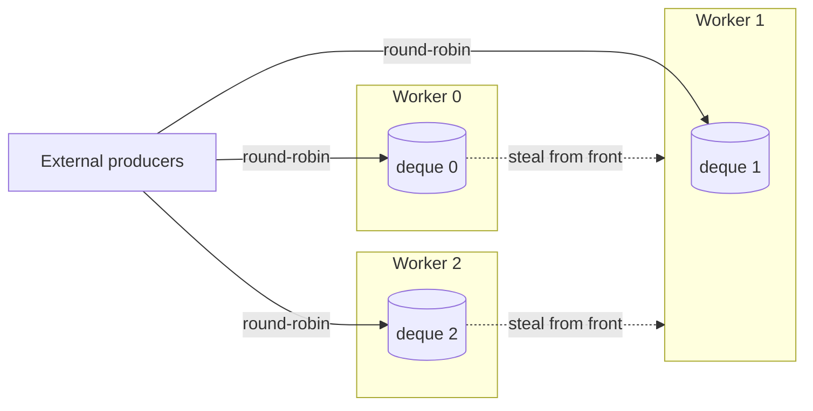

# Work-Stealing Thread Pool (C++17)

A header-only C++17 thread pool library with **per-worker task deques and work stealing**,
`std::future`-based results, exception propagation, graceful shutdown, and a
**deadlock-free fork-join wait** (`wait_and_help`). It includes a classic shared-queue pool
as a baseline, a 30-case test suite, and a benchmark suite comparing thread-per-task,
shared-queue, and work-stealing execution.

```cpp
#include "tp/thread_pool.hpp"

tp::ThreadPool pool(4);

auto result = pool.submit([] { return 10 + 20; });
std::cout << result.get();          // 30
```

## Features

- **Two pools, same API.** `tp::SharedQueuePool` is the classic design (baseline) and `tp::ThreadPool` is the work-stealing design.
- **Futures and exceptions.** `submit(f, args...)` returns a `std::future<R>`; exceptions thrown inside a task are re-thrown from `future.get()`, and the worker keeps running.
- **Move-only tasks.** A custom type-erased `Task` wrapper accepts move-only callables and arguments (e.g. `std::unique_ptr`), which `std::function` cannot hold.
- **Work stealing.** Each worker owns a deque. The owner pops from the back (LIFO, cache-friendly); idle workers steal from the front of others' deques (FIFO, oldest and usually largest work).
- **Fork-join without deadlock.** `wait_and_help(future)` runs other queued tasks while waiting, so recursive algorithms work even on a 1-worker pool.
- **Graceful shutdown.** New external submissions are rejected, all queued tasks (and children they spawn) finish, and all threads are joined. Idempotent and safe from multiple threads.
- **Instrumentation.** `stats()` reports tasks executed and tasks stolen.

## Build and run

Requires a C++17 compiler with `std::thread` support (GCC 9+, Clang 10+, or MSVC 2019+).

**Windows (MSYS2 MinGW-w64, from PowerShell in VS Code):**

```powershell
.\build.bat
.\build\tests.exe
.\build\deadlock_demo.exe
.\build\benchmark.exe --quick     # quick sanity run
.\build\benchmark.exe             # full run, prints Markdown tables
```

**Linux / WSL / macOS:**

```bash
./build.sh            # builds everything into build/
./build/tests
./build.sh tsan       # runs the tests under ThreadSanitizer
```

**CMake (any platform):** `cmake -S . -B build && cmake --build build --config Release`

## Design



**Worker loop:** pop from own deque, otherwise steal from another deque, otherwise sleep on a
condition variable. A task submitted from inside a worker goes to that worker's own deque with
no global lock.

**Key correctness decisions:**

- **Tasks run outside every lock.** A worker pops under its deque's mutex, releases it, then runs the task.
- **Condition-variable waits use predicates**, which protects against spurious wakeups.
- **No lost wakeups.** An atomic `pending_` counter tracks tasks that are queued but not yet taken, and workers only sleep when it is zero. For internal submissions a seq_cst handshake (`pending_++` then read `sleepers_` on one side, `sleepers_++` then read `pending_` on the other) guarantees that either the worker sees the task or the submitter sees the sleeper and wakes it, without taking a global lock on every submit.
- **Draining shutdown.** Workers exit only when `stopping_ && pending_ == 0`. Tasks submitted by running tasks during shutdown are still accepted, so fork-join work drains cleanly.
- **Exception safety in the constructor.** If creating a thread fails, already-started threads are joined before re-throwing (destroying a joinable `std::thread` would call `std::terminate`).
- **No false sharing.** Per-worker deques and counters are `alignas(64)` so each sits on its own cache line.
- **Misuse is reported.** Calling `shutdown()` from inside a task throws `std::logic_error` instead of deadlocking.

### The nested-wait deadlock

If every worker is running a task that blocks on `future.get()` for a child task still sitting
in a queue, no worker is left to run the children and the pool hangs forever.
`examples/deadlock_demo.cpp` reproduces this on both pools and shows `wait_and_help` fixing it:

```
SharedQueuePool + blocking wait:  DEADLOCK - child never ran (timed out after 1s)
ThreadPool      + blocking wait:  DEADLOCK - child never ran (timed out after 1s)
ThreadPool      + wait_and_help(): result = 42
```

## Testing

`tests/test_main.cpp` contains 30 test cases (most run against both pools): return values,
argument forwarding, move-only types, exception propagation, 8 concurrent producers × 5,000
tasks, shutdown draining, submit-after-shutdown, concurrent/idempotent shutdown, true parallel
execution, nested submission, fork-join on a single worker, verified stealing, and external-thread
helping. The suite has been run repeatedly under ThreadSanitizer and AddressSanitizer/UBSan with no
reports.

## Benchmarks

`bench/benchmark.cpp` reports the median of 5 runs for:

1. Thread-per-task vs both pools across four task sizes.
2. Worker scaling with tiny tasks and 4 concurrent producers.
3. Recursive task spawning (binary task tree).
4. Fork-join parallel Fibonacci speedup (work-stealing pool only; the shared pool deadlocks).
5. Submit-to-start latency under light load (avg, p50, p99).

**Results:** *(replace with the output of `benchmark.exe` on your machine, and name the CPU)*

Machine: `<CPU model, cores/threads, OS, compiler>`

| Experiment | Result |
|---|---|
| Tiny tasks: pool vs thread-per-task | _X×_ faster |
| Tiny tasks, max workers: ThreadPool vs SharedQueuePool | _Y×_ throughput |
| Fork-join fib speedup at max workers | _Z×_ vs sequential |

## Project structure

```
include/tp/task.hpp               move-only Task + packaging helper
include/tp/shared_queue_pool.hpp  baseline pool (one queue, one mutex)
include/tp/thread_pool.hpp        work-stealing pool
tests/test_main.cpp               test suite (no external dependencies)
bench/benchmark.cpp               benchmark suite
examples/                         basic usage + deadlock demo
```

## Limitations and future work

- **Mutex-protected deques.** A lock-free Chase–Lev deque would reduce stealing overhead further, at the cost of much harder memory-ordering reasoning.
- **Serialized external submissions.** External submissions take one global lock (to make the shutdown check race-free), so heavy multi-producer workloads still serialize there.
- **Blocking tasks.** A task that blocks on I/O still occupies a worker; the pool is designed for CPU-bound work.
- **Helping latency.** `wait_and_help` may pick up an unrelated long task, delaying the waiting parent (latency, not correctness).
- **Possible extensions:** task priorities, a dynamically sized pool, and cancellation.
